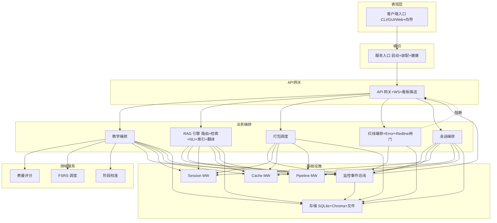

# 系统架构图-逻辑视图 — AITutor V3.1

> 接收：BP-001~BP-021 / DE-001~DE-048 / EX-001~EX-033 / BR-001~BR-050 / CE-001~CE-018
> 模式：分层 + 插件化 + 事件总线（混合架构）
> 视角：业务/产品/分析

---

## 一、架构总览（5 层 + 2 横切）

```
┌────────────────────────────────────────────────────────────────────┐
│  L5 表现层  CLI / GUI(待选) / Web / Python 库   (4 形态分发)       │
├────────────────────────────────────────────────────────────────────┤
│  L4 API 网关  FastAPI 路由 + Auth + OpenAPI + WebSocket Hub       │
├────────────────────────────────────────────────────────────────────┤
│  L3 业务编排  教学引擎 / RAG 管线 / 打包调度 / 红线编排 (8 编排器)  │
├────────────────────────────────────────────────────────────────────┤
│  L2 领域服务  鉴权 / 费曼 / FSRS / 阶段 / NLI / 翻译 / 索引  (7 域)│
├────────────────────────────────────────────────────────────────────┤
│  L1 基础设施  中间件 5 类(Session/Cache/Monitor/Pipeline/RAG) + DB │
└────────────────────────────────────────────────────────────────────┘
横切：监控埋点(M-006 监控事件总线) / 红线闸门(M-016 横切治理) / 错误处理(M-016)
事件总线：M-006（WS 推送 / 状态机转移 / LLM 兜底审计）
```

来源标注：[PRD:F-001~F-020] + [SA:BP-001~BP-021] + [SA:BR-002 单进程承载] + [SA:BR-003 5类中间件]

---

## 二、模块拓扑（主方案）



来源标注：[SA:BP-001~BP-021] + [SA:BR-002/003/009/046~050]

---

## 三、关键设计要点

| 要素 | 设计 | 来源 |
|------|------|------|
| 单进程承载 | FastAPI 单进程 + 单端口 | [SA:BR-002] |
| 5 类中间件 | Session/Cache/Monitor/Pipeline/RAG 强制装配 | [SA:BR-003] |
| 状态机/兜底 | 90% FSM + 10% LLM(带 trace_id+审计) | [SA:BR-009/010] |
| 缓存降级 | 默认 SQLite / 生产 Redis 不可用降 SQLite | [SA:BR-006] |
| 抖动防雪崩 | expires_at ±20% | [SA:BR-027] |
| 红线闸门 | 4 工具链退出码 0 才允许 PR merge | [SA:BR-046/048/049] |
| NLI 100%带源 | 评分<0.7 重检索≤3 轮 / 显式"无法确认" | [SA:BR-016~018] |
| FSRS Again 节流 | 5 分钟内仅 1 次 Again | [SA:CE-004] |
| 阶段 hysteresis | 升/降档各需连续 2 天 | [SA:BR-014] |
| 打包与覆盖率仲裁 | 覆盖率硬约束 / 体积 warn only | [SA:CE-011] |

---

## 四、模式一致性声明

- **分层**：L1→L2→L3→L4→L5 单向依赖，禁止跨层调用（如 L3 直接读 L5 资源）
- **事件总线**：状态机转移 / WS 推送 / 兜底审计统一走 M-006，模块间不直接函数调用
- **插件化**：翻译 / NLI / OCR / LLM provider 通过 L2 抽象接口注入，BR-003 强制 5 类 + 后续插件走同一 SPI
- **数据视图**：DE-046/047/048 三个红线实体仅由 M-016 红线编排产生，避免数据孤岛

来源标注：[TD推断:依据=soul 4.8.2 模式一致性约束]
