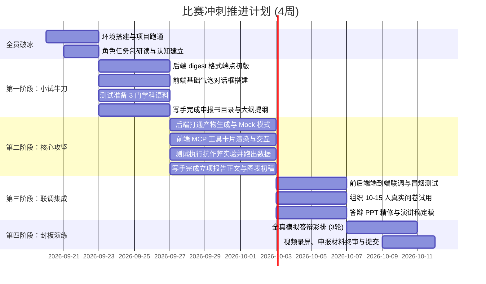

# AI-Tutor 比赛冲刺：项目总控与队长手册

> **项目目标**：面向大学生创新创业/AI 应用类竞赛（如“互联网+”、挑战杯、大创等），基于成熟的 7 层认知底座进行竞赛级优化与包装。
> **周期规划**：3-4 周冲刺
> **团队架构**：1 名队长（架构把关/接口守门/突发兜底）+ 3 名新人（前端、后端、测试/写手）
> **参考备份分支**：`ref/ai-stubs-backup`（包含前期自动化桩代码与压测用例，队长可随时按需查阅参考）

---

## 一、 团队角色与分工矩阵

| 成员角色 | 责任范畴 | 核心交付物 | 对应独立任务包文件 |
|---|---|---|---|
| **队长 (Leader)** | 全局统筹、API 契约维护、Code Review、突发 Bug 兜底、全链路冒烟集成 | 接口定义、合并审核、演示环境就绪 | 本手册 |
| **前端新手 (Frontend)** | 打造会话式学习主界面，将底层 MCP 能力以结构化卡片（Tool-Calling Cards）呈现在对话流中 | Web 会话主界面、MCP 工具交互卡片组件库 | [`01_前端任务包_Web会话与MCP卡片.md`](./01_前端任务包_Web会话与MCP卡片.md) |
| **后端新手 (Backend)** | 补齐 `digest` 和 `sync` 路由，打通真实/Mock 双轨机制，保障演示 100% 不翻车 | 完整 REST 接口、本地演示 Mock 开关、自动化单元测试 | [`02_后端任务包_接口桥接与演示保障.md`](./02_后端任务包_接口桥接与演示保障.md) |
| **测试评估 (Evaluation)** | 构建 3 学科测试语料，跑通抗作弊与建图质量实验；组织 10-15 人问卷测评产出图表 | 实验量化分析报告、SUS 可用性问卷数据图表包 | [`03_测试评估任务包_双轨实验与数据图表.md`](./03_测试评估任务包_双轨实验与数据图表.md) |
| **竞赛写手 (Writer)** | 提炼 3 大核心创新点，消化 7 层认知架构与降阶学习法，打造打动评委的竞赛材料 | 申报书主报告、路演 PPT、3 分钟演示脚本、答辩攻防表 | [`04_竞赛写手任务包_四件套与答辩剧本.md`](./04_竞赛写手任务包_四件套与答辩剧本.md) |

---

## 二、 队长三条“护城河”原则（新手防坑指南）

由于 3 位组员均为新手，队长切忌当“甩手掌柜”或“一人包办”，必须守住以下三条底线：

### 1. 契约驱动先行（API Contract First）
* **原则**：在前端和后端写第一行业务代码之前，由队长在群里把请求方法、URL、入参格式、响应 JSON 定死。
* **规则**：所有接口一律严格遵循系统现有信封格式：
  ```json
  {
    "ok": true,
    "data": { ... }
  }
  ```
  或者出错时：
  ```json
  {
    "ok": false,
    "error": { "code": "ERROR_CODE", "message": "人话错误描述" }
  }
  ```
* **效果**：前端新人可以用静态假数据（Mock）无阻塞做界面，后端新人对齐入参输出写逻辑，双方互不拖延。

### 2. 分支绝对隔离与单向合并
* **保护 `main` 分支**：严禁新人直接在 `main` 上提交代码。
* **标准分支命名**：
  * 前端：`feat/frontend-chat-cards`
  * 后端：`feat/backend-router-bridge`
  * 测试：`test/benchmark-suite`
  * 写手：`docs/competition-dossier`
* **合入标准（Definition of Done）**：
  1. 必须在各自电脑上运行 `uv run pytest`，保证现有的 939+ 个测试 100% 全绿。
  2. 队长亲自走一遍功能验收，确认无副作用后再执行 `git merge`。

### 3. 每日 15 分钟“三句话”站会（Standup）
每天固定一个时间（如晚上 21:00 线上语音 15 分钟），每人轮流回答：
1. **今天完成了哪个小功能/段落？**
2. **明天准备推进哪个小点？**
3. **遇到了什么具体卡点？**（重点！新手遇到技术阻碍往往容易陷入自我怀疑或耗费半天无果，**只要超过 1 小时未解决，队长必须立即介入指点**）。

---

## 三、 3-4 周比赛冲刺甘特图



---

## 四、 队长演示保障与演练策略（现场断网防翻车）

双创比赛现场网络极不稳定，且公有云 LLM API 极易发生并发限流（429）或延迟飙高。队长必须在项目第三周落实**双轨演示保障方案**：

1. **环境一键启动脚本**：
   * 确保 `run_aitutor.py` 或打包后的桌面端能“一键拉起”，无任何终端报错。
2. **预置演示科目数据（Golden Demo Subject）**：
   * 提前在本地 SQLite 中预先建好一套堪称完美的知识图谱与教学状态（推荐科目：《计算机操作系统：进程与线程》或《微观经济学：供求曲线》）。
   * 现场即使没有外部网络，系统直接读取本地缓存的富化概念、生成的思维导图与测验题，1 秒内瞬时渲染，震撼评委。
3. **真实/Mock 无感切换**：
   * 后端通过环境变量或前端设置页面的一个小开关 `VITE_DEMO_MODE=true`，决定是否直接返回预置的精美回答与卡片。

---

## 五、 任务包分发指引

请将本目录下的 4 份文档直接发送给对应组员：
* 给前端同学：[`01_前端任务包_Web会话与MCP卡片.md`](./01_前端任务包_Web会话与MCP卡片.md)
* 给后端同学：[`02_后端任务包_接口桥接与演示保障.md`](./02_后端任务包_接口桥接与演示保障.md)
* 给测试同学：[`03_测试评估任务包_双轨实验与数据图表.md`](./03_测试评估任务包_双轨实验与数据图表.md)
* 给写手同学：[`04_竞赛写手任务包_四件套与答辩剧本.md`](./04_竞赛写手任务包_四件套与答辩剧本.md)

通知语示范：
> “大家先阅读各自任务包里的【第一部分：任务目标与成果】和【第二部分：新手 2 周学习路线】。前 3 天不要有代码压力，先跟着文档里的步骤把本地环境跑通，体验现有功能。有任何疑问随时在群里 @ 我！”
